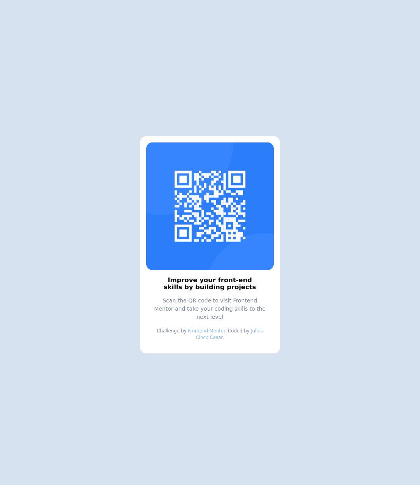

# Frontend Mentor - QR code component solution

This is a solution to the [QR code component challenge on Frontend Mentor](https://www.frontendmentor.io/challenges/qr-code-component-iux_sIO_H). Frontend Mentor challenges help you improve your coding skills by building realistic projects. 

## Table of contents

- [Frontend Mentor - QR code component solution](#frontend-mentor---qr-code-component-solution)
  - [Table of contents](#table-of-contents)
  - [Overview](#overview)
    - [Screenshot](#screenshot)
    - [Links](#links)
  - [My process](#my-process)
    - [Built with](#built-with)
    - [What I learned](#what-i-learned)
    - [Useful resources](#useful-resources)
  - [Author](#author)
  - [Acknowledgments](#acknowledgments)

## Overview

This is my solution to the QR Code challenge.

### Screenshot

### Links

- Solution URL: [Source Code](https://github.com/knznsmn/fem/)
- Live Site URL: [QR Code Component](https://fem.jccesar.com/01-qr-code/)

## My process

### Built with

- Semantic HTML5 markup
- CSS custom properties
- Flexbox
- Mobile-first workflow

### What I learned

I learned to write mobile-first, responsive web development.

### Useful resources

- [Modern CSS reset](https://www.joshwcomeau.com/css/custom-css-reset/)
- [A (More) Modern CSS Reset](https://piccalil.li/blog/a-more-modern-css-reset/)

## Author

- Website - [Julius Cinco Cesar](https://www.jccesar.com)
- Frontend Mentor - [@knznsmn](https://www.frontendmentor.io/profile/knznsmn)
- Twitter - [@knznsmn](https://www.twitter.com/knznsmn)

## Acknowledgments

Thanks to these super mentors! Wish they'll stay by my side while I grow!

[@KapteynUniverse](https://www.frontendmentor.io/profile/KapteynUniverse)  
[@sksksk2024](https://www.frontendmentor.io/profile/sksksk2024)